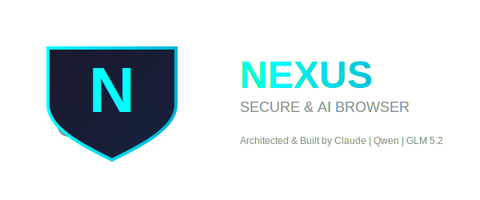

  

  
<b>A privacy-first, high-performance desktop browser, built from scratch in Rust.</b>

  
  
  

 

## Table of Contents
- [Introduction](#introduction)
- [How It Compares](#how-it-compares)
- [Key Features](#key-features)
- [System Requirements](#system-requirements)
- [Tor & WARP Setup](#tor--warp-setup)
- [AI Assistant Setup](#ai-assistant-setup)
- [Development Notes](#development-notes)
- [Contributing](#contributing)
- [License](#license)

## Introduction

NEXUS is a desktop browser built from the ground up in Rust, on top of `wry` and `tao` rather than a full Chromium build. The goal is straightforward: a browser that doesn't phone home, doesn't need a paid tier, and doesn't quietly eat your RAM in the background.

It ships with an encrypted password vault, ad/tracker blocking, one-click Tor and Cloudflare WARP routing, and a native AI assistant you connect with your own API key — nothing sits between you and the model you choose.

## How It Compares

The numbers below are from our own casual testing, not an independent benchmark — treat them as a general shape, not a guarantee.

| Feature | NEXUS | Chrome | Brave |
|---|:---:|:---:|:---:|
| Core engine | Rust + OS WebView | Chromium (C++) | Chromium (C++) |
| Telemetry | None | Heavy | Anonymized |
| Idle RAM (approx.) | Low | High | Moderate |
| Ad / tracker blocking | Built in | Extension required | Built in |
| Password vault | AES-256-GCM + Argon2id | Basic | Basic |
| Tor / WARP, one click | Yes | No | No (Tor only via a separate extension) |
| Native AI, bring-your-own-key | Yes | No | Brave Leo only |
| Multi-threaded downloads | Yes, segmented | Limited | Limited |
| Complex web-app compatibility | Good, not universal | Complete | Complete |

NEXUS runs on the OS's native WebView instead of shipping Chromium — that's most of where the memory savings come from, and also where the occasional compatibility gap with very complex web apps comes from.

## Key Features

### Privacy & Security
- Ad and tracker blocking, including YouTube ad-skip
- Blocks common tracking cookies and intercepts tracker-related `fetch` / `XHR` / `sendBeacon` calls
- Reduces canvas/WebGL/hardware-concurrency fingerprinting surface
- DNS-level sinkhole for known ad and malware domains
- HTTPS upgrading and stripping of tracking parameters (`utm_*`, `gclid`, `fbclid`) from URLs

> Anti-fingerprinting reduces what a site can read about your machine — it isn't full anonymity. Pair it with Tor if that's what you need.

### Encrypted Vault
Passwords are stored locally, encrypted with AES-256-GCM, with the key derived via Argon2id. Nothing syncs to a server, because there isn't one.

### AI Assistant
A toolbar-integrated assistant you configure with your own API endpoint, key, and model — Claude, Qwen, GLM, GPT, or anything else that speaks a compatible API. Requests go straight from your machine to that provider.

### Performance
- Background tabs idle for 5+ minutes are automatically suspended to free up RAM and CPU
- Downloads split into up to 16 concurrent chunks on servers that support range requests — actual speedup depends on your connection and the server, not a fixed number
- Built on Tokio's async runtime for non-blocking networking

### Anonymity
- One-click routing of a tab through Tor or Cloudflare WARP (requires their official client already running locally — see setup below)

## System Requirements

| Component | Minimum |
|---|---|
| **OS** | Windows 10/11 (64-bit), macOS 11+ (Big Sur), Linux (Ubuntu 20.04+, Fedora 34+, Arch) |
| **CPU** | Dual-core 64-bit (Intel Core i3 / AMD Ryzen 3 class or better) |
| **RAM** | 2 GB (NEXUS itself idles low; web pages will use their own memory as usual) |
| **Storage** | 150 MB free |
| **Graphics** | WebGL support (integrated graphics such as Intel UHD are fine) |

## Tor & WARP Setup

The one-click Tor / WARP toggles in NEXUS route traffic through a local proxy — they don't bundle or replace either client, so you need the real thing running first:

1. **Tor:** install [Tor Browser](https://www.torproject.org/download/) or the Tor daemon, and make sure it's listening on `127.0.0.1:9050`.
2. **Cloudflare WARP:** install [Cloudflare WARP](https://1.1.1.1/), and make sure it's actually running in **local proxy mode** on `127.0.0.1:2053` — the default consumer toggle runs WARP as a system-wide VPN instead, which won't work with this integration.

Once one of those is genuinely listening, flip the matching switch in the NEXUS sidebar.

## AI Assistant Setup

1. Open NEXUS and click the AI icon in the toolbar.
2. Enter an API endpoint (e.g. `https://api.anthropic.com/v1/messages`, `https://api.openai.com/v1/chat/completions`, or a local server).
3. Enter your API key.
4. Enter the model name (e.g. `claude-sonnet-4-6`, `qwen-max`, `glm-5.2`).
5. Save and start chatting.

Your prompts go directly to whichever endpoint you configure — NEXUS doesn't proxy or log them.

## Development Notes

NEXUS is written and maintained by [**@LocShadowVN**](https://github.com/LocShadowVN), with AI coding assistants (Claude, Qwen, GLM) used throughout the build for implementation help and debugging. The architecture, tradeoffs, and final review are human-driven — the AI tools sped up typing, not decision-making.

## Contributing

NEXUS is open to contributions from the Rust community and privacy-minded developers. Found a bug or have a feature idea? Open an issue or a pull request.

## License

Distributed under **MPL-2.0 OR Apache-2.0** — see LICENSE-MPL and LICENSE-APACHE for details. No paid tier, no plans for one.

 
Built in Rust, by one developer who'd rather own a browser than rent one. 🦀

